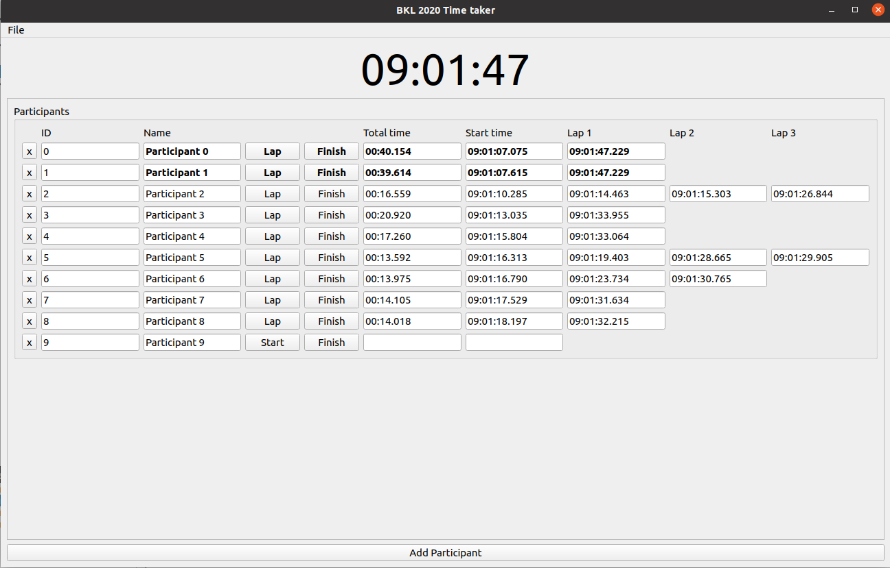

# Racetiming
Very simple running race timing application written in QT

# Usage
It is so simple it should be pretty much self-explanatory.

Just add your participants and start their time.

You can save the participant list to a json file and load it later.

To do post-processing of the time, use the "save timing" menu option. It saves it to .csv file.

# Screenshots

